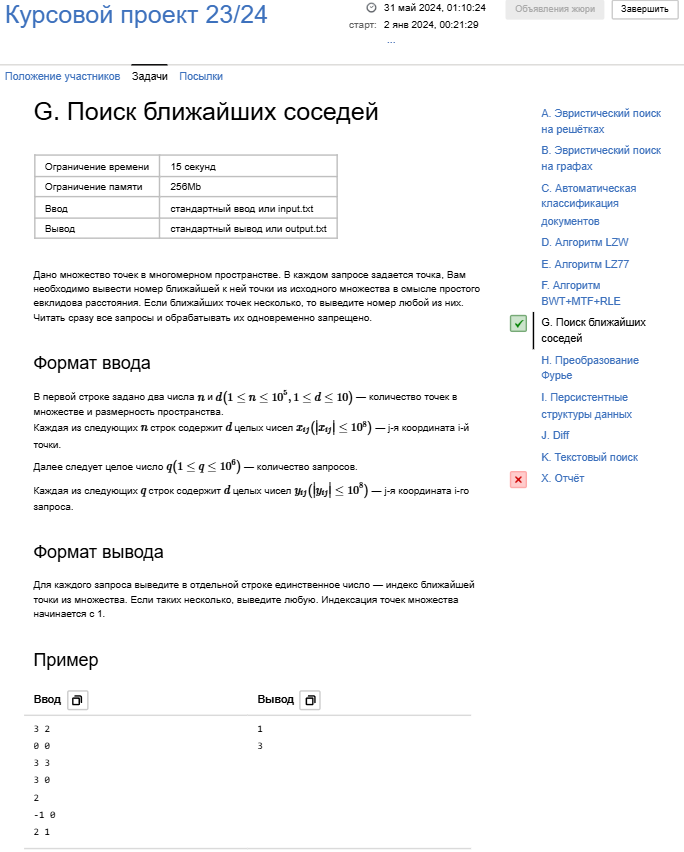

# Курсовой проект: 

**Поиск ближайших соседей**

Дано множество точек в многомерном пространстве. В каждом запросе задается точка, Вам необходимо вывести номер ближайшей к ней точки из исходного множества в смысле простого евклидова расстояния. Если ближайших точек несколько, то выведите номер любой из них.
Читать сразу все запросы и обрабатывать их одновременно запрещено.